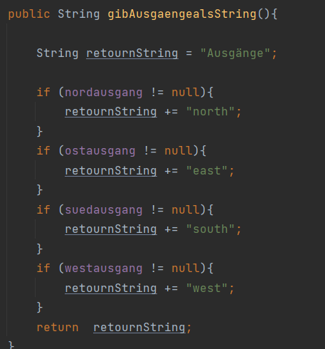

## Mikroarchitektur-Teil-1
### BLUEJ-BUCH KLASSENENTWURF Kapitel 8
Entwurf nach Zuständigkeiten  
Kohäsion, Kopplung, Refactoring

#### Kopplung:
Beschreibt den Grad der Abhängigkeiten zwischen Klassen. Grad gibt an wie eng die Klassen verknüpft sind.
Deswegen wollen wir jede Klasse unabhängig ist für eine lose Kopplung.

#### Kohäsion:
Beschreibt wie gut eine Programmiereinheit eine logische Aufgabe abbildet.
Hoher Kohäsion: ist jede Methode, eine Klasse oder ein Modul verantwortlich für genau eine Aufgabe.
Guter Klassenentwurf weist einen hohen Grad an Kohäsion.

#### Code-Duplizierung:
ist ein Indiz für einen schlechten Entwurf, sollte vermieden werden.

#### Kapselung:
Saubere Kapselung reduziert die Kopplung und führt zu besseren Entwürfen.

##### Übung 8.1 Projekt: "Zuul-schlecht"  

Was tut diese Anwendung?  
"World of Zuul" ist ein sehr einfaches, textbasiertes Abenteuerspiel.
Der Benutzer kann durch einige Landschaften laufen.  

Welche Befehle akzeptiert das Spiel?  
Hilfe, quit, gehe "irgendwohin" 

Was bewirken die einzelnen Befehle?  
help: Liefert Informationen über die verfügbaren Befehle  
quit: Beendet das Spiel  
Gehe "irgendwohin": Geht durch die Tür in die angegebene Richtung. Die Richtungen können eine der folgenden sein: Norden, Osten, Süden und Westen. 

Wie viele Räume gibt es in der virtuellen Umgebung?  
Es gibt 5 Räume 

##### Übung 8.5: eigene Methode rauminfoAusgeben:

##### Übung 8.6: Änderungen an Klasse Raum:

##### Übung 8.7: Neue Methode definieren:
    

#### Übung 8.8: beschriebene Änderungen implementieren:
        

#### Übung 8.9: Methode keySet. Was tut Sie?:  
Gibt eine Set-Ansicht der Map-Schlüssel zurück. Änderungen in Map oder Set beeinflussen einander.
Während einer Iteration sind Änderungen riskant.
Entfernen ist erlaubt, Hinzufügen nicht.

#### Übung 8.10: Methode "gisAusgaengealsString":  
Zunächst wird eine Zeichenkette namens returnString mit dem Initialtext "Exits: ". Wir werden dann die Exits zu diesem String hinzufügen und ihn schließlich zurückgeben.
Die Namen der verfügbaren Ausgänge werden hinzugefügt, indem wir die Menge der Schlüssel aus der HashMap der Ausgänge abrufen.
Wir iterieren dann durch die Menge der Schlüssel und fügen in jeder Iteration den Schlüssel des Ausgangs zu returnString hinzu

#### Übung 8.11: Änderungen implementieren:  
   

#### Übung 8.11: Änderungen implementieren:  

### Änderungen lokal halten:
Eines der Hauptziele eines guten Klassenentwurfs lautet: Änderungen lokal halten
eine Änderung an einer Klasse sollte möglichst geringen Einfluss auf andere Klassen haben.

#### Übung 8.15:Einen weiteren Befehl hinzufügen  
 

#### Übung 8.17:   
Nein, weil die Liste der Befehle aus dem Array erzeugt und 
enthält daher automatisch alle neuen Befehle, die diesem Array hinzugefügt wurden.

#### Übung 8.18:Implementieren der Änderungen  
   

#### Übung 8.21:  
a) Räume sollten wissen, welche Gegenstände sie enthalten und diese Informationen generieren.

b) Die Klasse für Gegenstände sollte für die Erstellung der Beschreibungen der Gegenstände verantwortlich sein.

c) Die Spielklasse sollte die Beschreibungen der Gegenstände ausgeben, aber normalerweise passiert dies, wenn ein Raum beschrieben wird, der die Gegenstände enthält.  

#### Übung 8.22:  
Siehe die Klassen Gegenstände, Raum. 

#### Übung 8.23: Befehl zurück einfügen  
  

#### Übung 8.24:  
Wenn das Spiel gerade gestartet wird, gibt es keinen vorherigen Raum. 
In der obigen Implementierung wird dies behandelt, indem eine Meldung an den Benutzer ausgegeben  

#### Übung 8.25:  
Wenn Sie zweimal "Zurück" eintippen, landen Sie in dem Raum, in dem Sie beim ersten Mal waren.

#### Übung 8.26:  
   

#### Übung 8.27:  
Einige der Tests könnten sein:
- Testen, dass die Räume richtig angeschlossen sind.
- Testen, dass alle Befehle erkannt werden und wie erwartet funktionieren.  

#### Übung 8.28:  
   

#### Übung 8.35:  
Fügen Sie dies in Game.processCommand ein:
else if (commandWord == CommandWord.LOOK) {
look();
}
Und fügen Sie diese Methode zu Game hinzu:
private void look()
{
System.out.println(currentRoom.longDescription());
}  

#### Übung 8.36:  
Die Verwendung unterschiedlicher Befehlswörter erfordert nur Änderungen in der Klasse CommandWords.  

#### Übung 8.37:  
Wenn das Befehlswort für Hilfe geändert wird, wird es NICHT in der Begrüßungsmeldung geändert.  

#### Übung 8.38:  
public enum Direction
{
NORTH, SOUTH, EAST, WEST
} 

#### Übung 8.39:  
Hier müssen wir der Klasse "Game" noch die Funktionalität dieser Klasse hinzufügen.  

#### Übung 8.40:  
Ja. Es wird nur das Enum selbst verwendet  
